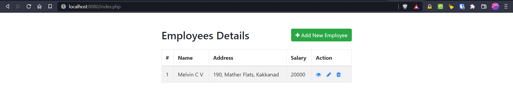
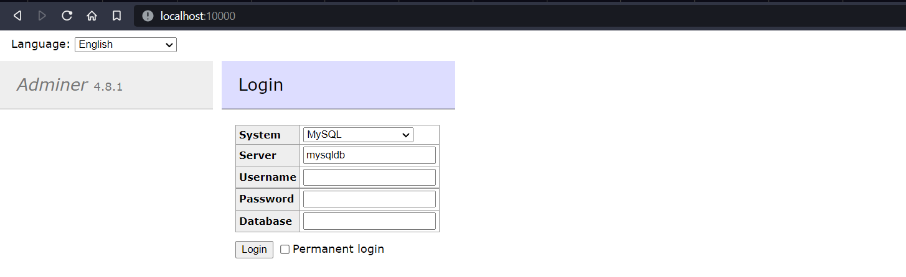

# Kubernetes Deployment Series - PHP

This is a PHP based app that can be used for CRUD operations. Data is stored in a MySQL DB Table.



## Docker Deployment (using Compose v2)

### App Configuration

Replace the database parameters in php-crud-app/app/config.php with your own.

### Docker Build File

Create a Dockerfile that uses the php image from Docker Hub (php:8.1-apache)
Location: php-crud-app/app/Dockerfile

We will build the image using the docker compose file below.

### Docker Compose

Create a Docker Compose file: php-crud-app/docker-compose.yml

1. created 2 networks: frontend, backend
2. created 2 volumes: www-data, db-data
3. created 3 services: phpcrudapp, mysqldb, adminer
    - phpcrudapp runs the image we built previously. It runs on port 8080.
    - mysqldb runs a mysql image and creates a DB. It runs on the backend network only and port is not exposed.
    - adminer is an interface that can be used to login 

Create a .env file that has the secret info:

```
MYSQL_ROOT_PASSWORD=xxxxxxxxxxxxxx
MYSQL_PASSWORD=xxxxxxxxxxxxx
```

Build the image and bring up the whole stack:

```
docker compose up -d --build
```

To bring the stack down (keep volumes), do:

```
docker compose down
```

The App should be available on port 8080
Adminer is available on localhost port 10000 only for security reasons.

1. Do SSH local port forwarding to get the adminer panel (preferred)

```
ssh -L 10000:localhost:10000 ...
```


2. Or remove the localhost portion: 127.0.0.1

```
    ports:
      - "127.0.0.1:10000:8080"
```

### SQL Table Creation

Run the queries in sql\db-queries.sql after setting a password in it.

### Reference

https://www.tutorialrepublic.com/php-tutorial/php-mysql-crud-application.php

### Connect with me on LinkedIn

https://www.linkedin.com/in/melvin-c-varghese-496360167/

---

#### Note

Do not waste your time trying to hack my DB. It's not possible :)
